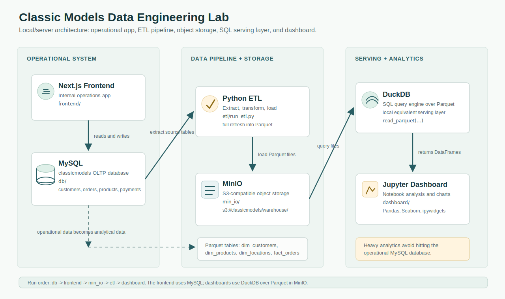

# Data Engineering Lifecycle Lab on Your Own Server

This guide explains how to run the full local data engineering lab on a Mac mini, laptop, or server.

The project demonstrates a realistic data flow:

```text
Operational app + MySQL -> ETL -> MinIO object storage -> DuckDB queries -> Jupyter dashboard
```



The local stack uses:

- **MySQL** as the operational source database.
- **Next.js frontend** as a small internal operations app that interacts with MySQL.
- **Python ETL** to transform normalized operational data into analytical Parquet files.
- **MinIO** as local S3-compatible object storage.
- **DuckDB** as the SQL query engine over Parquet files.
- **Jupyter Lab** as the analysis and dashboard environment.
- **Docker Compose** to run each service.

## 1. Prerequisites

Install Docker or another Docker-compatible runtime.

On this Mac mini setup, Colima plus the legacy `docker-compose` command works well:

```bash
brew install colima docker docker-compose
colima start --cpu 2 --memory 4 --disk 20
docker context use colima
```

Verify Docker:

```bash
docker --version
docker-compose --version
docker ps
```

If your environment supports the newer Docker Compose plugin, you can use `docker compose` instead of `docker-compose`.

## 2. Start the Source Database

The source system is the `classicmodels` MySQL database. It represents a retailer that sells scale models of classic cars and other vehicles.

Start MySQL:

```bash
cd db
docker-compose up -d --build
```

Connect to the database:

```bash
docker exec -it classicmodels-mysql mysql -uadmin -padminpwrd classicmodels
```

Explore the tables:

```sql
SHOW TABLES;
SELECT COUNT(*) FROM customers;
SELECT COUNT(*) FROM orders;
SELECT COUNT(*) FROM orderdetails;
EXIT;
```

You should see tables such as:

- `customers`
- `employees`
- `offices`
- `orderdetails`
- `orders`
- `payments`
- `productlines`
- `products`

More details are in:

```text
db/README.md
db/README.es.md
```

## 3. Start the Operations Frontend

The frontend helps students understand how a real operational application might use the database.

It shows customers, orders, products, employees, reports, and a schema page.

Run it locally:

```bash
cd frontend
npm install
npm run dev
```

Open:

```text
http://localhost:3000
```

From another computer on the same local network, use the Mac mini/server IP:

```text
http://SERVER_IP:3000
```

The frontend reads and writes to MySQL. This is the operational side of the system.

More details are in:

```text
frontend/README.md
```

## 4. Start MinIO Object Storage

MinIO is local S3-compatible object storage. It stores the transformed Parquet files produced by the ETL step.

Start MinIO:

```bash
cd min_io
docker-compose up -d
```

Open the MinIO console:

```text
http://localhost:9001
```

Login:

```text
Username: minioadmin
Password: minioadmin
```

The setup creates this bucket:

```text
classicmodels
```

The S3-compatible API endpoint is:

```text
http://localhost:9000
```

More details are in:

```text
min_io/README.md
```

## 5. Run the ETL Job

ETL means **Extract, Transform, Load**:

- **Extract:** read source data from MySQL.
- **Transform:** reshape normalized operational tables into analytical tables.
- **Load:** write transformed data as Parquet files into MinIO.

Run the one-shot ETL container:

```bash
cd etl
docker-compose up --build
```

The container exits when the ETL finishes.

It writes:

```text
s3://classicmodels/warehouse/dim_customers/dim_customers.parquet
s3://classicmodels/warehouse/dim_products/dim_products.parquet
s3://classicmodels/warehouse/dim_locations/dim_locations.parquet
s3://classicmodels/warehouse/fact_orders/fact_orders.parquet
```

You can inspect those files in MinIO:

```text
http://localhost:9001
```

The ETL currently behaves like a full refresh. If you run it multiple times, the latest run replaces the same Parquet objects. It does not append duplicate rows or create a new folder per run.

More details are in:

```text
etl/README.md
```

## 6. Query the Data with DuckDB

MinIO stores files, but it does not run SQL queries. DuckDB is the local SQL query engine that reads the Parquet files from MinIO.

A useful mental model:

```text
MinIO = where the analytical files live
DuckDB = the SQL engine that reads those files
```

DuckDB does not replace MySQL. MySQL is the operational source database. DuckDB queries the transformed analytical Parquet files.

Install DuckDB locally:

```bash
pip install duckdb
```

Run a quick query:

```python
import duckdb

con = duckdb.connect()

con.sql("INSTALL httpfs;")
con.sql("LOAD httpfs;")

con.sql("SET s3_region='us-east-1';")
con.sql("SET s3_endpoint='localhost:9000';")
con.sql("SET s3_access_key_id='minioadmin';")
con.sql("SET s3_secret_access_key='minioadmin';")
con.sql("SET s3_use_ssl=false;")
con.sql("SET s3_url_style='path';")

result = con.sql("""
    SELECT
        p.productLine,
        ROUND(SUM(f.orderAmount), 2) AS total_sales
    FROM read_parquet('s3://classicmodels/warehouse/fact_orders/*.parquet') f
    JOIN read_parquet('s3://classicmodels/warehouse/dim_products/*.parquet') p
        ON f.productCode = p.productCode
    GROUP BY p.productLine
    ORDER BY total_sales DESC
""").df()

print(result)
```

## 7. Run the Jupyter Dashboard

The dashboard uses the DuckDB Python library to query Parquet files from MinIO, then builds charts with Pandas, Seaborn, Matplotlib, and ipywidgets.

Start Jupyter:

```bash
cd dashboard
docker-compose up -d --build
```

Open:

```text
http://localhost:8888/lab?token=classicmodels
```

Open this notebook:

```text
classicmodels_dashboard_duckdb.ipynb
```

The dashboard flow is:

```text
Jupyter Notebook -> DuckDB -> Parquet files in MinIO -> charts/dashboard
```

More details are in:

```text
dashboard/README.md
```

## 8. Stop Services

Stop each service from its folder:

```bash
cd frontend
docker-compose down
```

```bash
cd dashboard
docker-compose down
```

```bash
cd etl
docker-compose down
```

```bash
cd min_io
docker-compose down
```

```bash
cd db
docker-compose down
```

To delete stored MySQL or MinIO data, use `-v` with the corresponding Compose project:

```bash
docker-compose down -v
```

Use this carefully because it removes the local Docker volumes.

## 9. Troubleshooting

### Docker Compose command does not work

If this fails:

```bash
docker compose up -d
```

use:

```bash
docker-compose up -d
```

This repo was tested with Colima and the legacy `docker-compose` command.

### MySQL is not reachable

Check that the database container is running:

```bash
docker ps
```

Check logs:

```bash
docker logs classicmodels-mysql
```

### MinIO is not reachable

Check:

```bash
docker ps
docker logs classicmodels-minio
```

Open:

```text
http://localhost:9001
```

### ETL cannot connect to MySQL or MinIO

The ETL container must be able to join both Docker networks:

```text
db_default
min_io_default
```

Check networks:

```bash
docker network ls
```

Make sure MySQL and MinIO are already running before starting the ETL.

### Jupyter cannot query MinIO

Inside the Jupyter container, the MinIO endpoint is:

```text
classicmodels-minio:9000
```

From your host machine, the MinIO endpoint is:

```text
localhost:9000
```

The dashboard notebook reads `S3_ENDPOINT` from the environment, so the Docker Compose setup configures this automatically.

## 10. What You Have Built

By the end, you have a full local data engineering lifecycle:

1. **Operational database:** MySQL stores transactional source data.
2. **Operational app:** Next.js frontend interacts with MySQL.
3. **ETL:** Python extracts, transforms, and loads data.
4. **Object storage:** MinIO stores transformed Parquet files.
5. **Query engine:** DuckDB queries Parquet directly from object storage.
6. **Dashboard:** Jupyter visualizes the query results.
